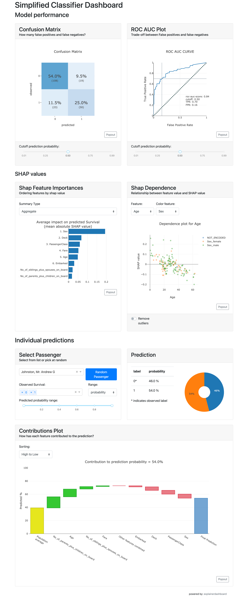
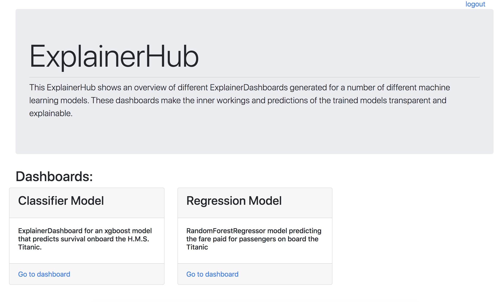
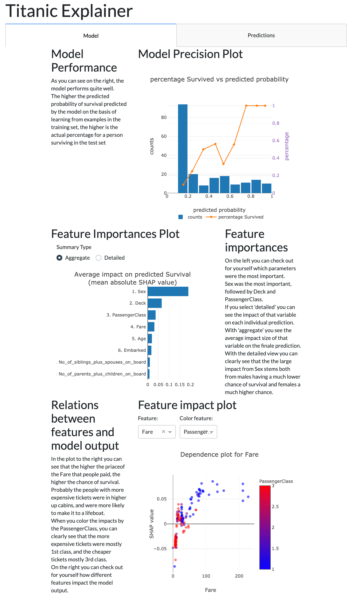

[](undefined)
[](https://pepy.tech/project/explainerdashboard)

# explainerdashboard
by: Oege Dijk

This package makes it convenient to quickly deploy a dashboard web app
that explains the workings of a (scikit-learn compatible) machine 
learning model. The dashboard provides interactive plots on model performance, 
feature importances, feature contributions to individual predictions, 
"what if" analysis,
partial dependence plots, SHAP (interaction) values, visualization of individual
decision trees, etc. 

You can also interactively explore components of the dashboard in a 
notebook/colab environment (or just launch a dashboard straight from there). 
Or design a dashboard with your own [custom layout](https://explainerdashboard.readthedocs.io/en/latest/buildcustom.html) 
and explanations (thanks to the modular design of the library). And you can combine multiple dashboards into
a single [ExplainerHub](https://explainerdashboard.readthedocs.io/en/latest/hub.html).

Dashboards can be exported to static html directly from a running dashboard, or 
programmatically as an artifact as part of an automated CI/CD deployment process.

 Examples deployed at: [titanicexplainer.herokuapp.com](http://titanicexplainer.herokuapp.com), 
 detailed documentation at [explainerdashboard.readthedocs.io](http://explainerdashboard.readthedocs.io), 
 example notebook on how to launch dashboard for different models [here](notebooks/dashboard_examples.ipynb), and an example notebook on how to interact with the explainer object [here](notebooks/explainer_examples.ipynb).

 Works with `scikit-learn`, `xgboost`, `catboost`, `lightgbm`, and `skorch` 
 (sklearn wrapper for tabular PyTorch models) and others.

 ## Installation

You can install the package through pip:

`pip install explainerdashboard`

or conda-forge:

`conda install -c conda-forge explainerdashboard`

## Demonstration:


<!-- [](https://postimg.cc/PCj9mWd7) -->
(for live demonstration see [titanicexplainer.herokuapp.com](http://titanicexplainer.herokuapp.com))
## Background

In a lot of organizations, especially governmental, but with the GDPR also increasingly in private sector, it is becoming more and more important to be able to explain the inner workings of your machine learning algorithms. Customers have to some extent a right to an explanation why they received a certain prediction, and more and more internal and external regulators require it. With recent innovations in explainable AI (e.g. SHAP values) the old black box trope is no longer valid, but it can still take quite a bit of data wrangling and plot manipulation to get the explanations out of a model. This library aims to make this easy.

The goal is manyfold:
- Make it easy for data scientists to quickly inspect the workings and performance of their model in a few lines of code
- Make it possible for non data scientist stakeholders such as managers, directors, internal and external watchdogs to interactively inspect the inner workings of the model without having to depend on a data scientist to generate every plot and table
- Make it easy to build an application that explains individual predictions of your model for customers that ask for an explanation
- Explain the inner workings of the model to the people working (human-in-the-loop) with it so that they gain understanding what the model does and doesn't do. This is important so that they can gain an intuition for when the model is likely missing information and may have to be overruled. 


The library includes:
- *Shap values* (i.e. what is the contributions of each feature to each individual prediction?)
- *Permutation importances* (how much does the model metric deteriorate when you shuffle a feature?)
- *Partial dependence plots* (how does the model prediction change when you vary a single feature?
- *Shap interaction values* (decompose the shap value into a direct effect an interaction effects)
- For Random Forests and xgboost models: visualisation of individual decision trees
- Plus for classifiers: precision plots, confusion matrix, ROC AUC plot, PR AUC plot, etc
- For regression models: goodness-of-fit plots, residual plots, etc. 

The library is designed to be modular so that it should be easy to design your own interactive dashboards with plotly dash, with most of the work of calculating and formatting data, and rendering plots and tables handled by `explainerdashboard`, so that you can focus on the layout
and project specific textual explanations. (i.e. design it so that it will be interpretable for business users in your organization, not just data scientists)

Alternatively, there is a built-in standard dashboard with pre-built tabs (that you can switch off individually)

## Examples of use

Fitting a model, building the explainer object, building the dashboard, and then running it can be as simple as:

```python
ExplainerDashboard(ClassifierExplainer(RandomForestClassifier().fit(X_train, y_train), X_test, y_test)).run()
```

Below a multi-line example, adding a few extra parameters. 
You can group onehot encoded categorical variables together using the `cats` 
parameter. You can either pass a dict specifying a list of onehot cols per
categorical feature, or if you encode using e.g. 
`pd.get_dummies(df.Name, prefix=['Name'])` (resulting in column names `'Name_Adam', 'Name_Bob'`) 
you can simply pass the prefix `'Name'`:

```python
from sklearn.ensemble import RandomForestClassifier
from explainerdashboard import ClassifierExplainer, ExplainerDashboard
from explainerdashboard.datasets import titanic_survive, titanic_names

feature_descriptions = {
    "Sex": "Gender of passenger",
    "Gender": "Gender of passenger",
    "Deck": "The deck the passenger had their cabin on",
    "PassengerClass": "The class of the ticket: 1st, 2nd or 3rd class",
    "Fare": "The amount of money people paid", 
    "Embarked": "the port where the passenger boarded the Titanic. Either Southampton, Cherbourg or Queenstown",
    "Age": "Age of the passenger",
    "No_of_siblings_plus_spouses_on_board": "The sum of the number of siblings plus the number of spouses on board",
    "No_of_parents_plus_children_on_board" : "The sum of the number of parents plus the number of children on board",
}

X_train, y_train, X_test, y_test = titanic_survive()
train_names, test_names = titanic_names()
model = RandomForestClassifier(n_estimators=50, max_depth=5)
model.fit(X_train, y_train)

explainer = ClassifierExplainer(model, X_test, y_test, 
                                cats=['Deck', 'Embarked',
                                    {'Gender': ['Sex_male', 'Sex_female', 'Sex_nan']}],
                                cats_notencoded={'Embarked': 'Stowaway'}, # defaults to 'NOT_ENCODED'
                                descriptions=feature_descriptions, # adds a table and hover labels to dashboard
                                labels=['Not survived', 'Survived'], # defaults to ['0', '1', etc]
                                idxs = test_names, # defaults to X.index
                                index_name = "Passenger", # defaults to X.index.name
                                target = "Survival", # defaults to y.name
                                )

db = ExplainerDashboard(explainer, 
                        title="Titanic Explainer", # defaults to "Model Explainer"
                        shap_interaction=False, # you can switch off tabs with bools
                        )
db.run(port=8050)
```

For a regression model you can also pass the units of the target variable (e.g. 
dollars):

```python
X_train, y_train, X_test, y_test = titanic_fare()
model = RandomForestRegressor().fit(X_train, y_train)

explainer = RegressionExplainer(model, X_test, y_test, 
                                cats=['Deck', 'Embarked', 'Sex'],
                                descriptions=feature_descriptions, 
                                units = "$", # defaults to ""
                                )

ExplainerDashboard(explainer).run()
```

`y_test` is actually optional, although some parts of the dashboard like performance
metrics will obviously not be available: `ExplainerDashboard(ClassifierExplainer(model, X_test)).run()`.

You can export a dashboard to static html with `db.save_html('dashboard.html')`. 


<details>
<summary>You can pass a specific index for the static dashboard to display</summary>
<p>

```
ExplainerDashboard(explainer, index=0).save_html('dashboard.html')
```

or 


```
ExplainerDashboard(explainer, index='Cumings, Mrs. John Bradley (Florence Briggs Thayer)').save_html('dashboard.html')
```
</p>
</details>

For a simplified single page dashboard try `ExplainerDashboard(explainer, simple=True)`.

<details><summary>Show simplified dashboard screenshot</summary>
<p>




</p>
</details>
<p></p>

### ExplainerHub

You can combine multiple dashboards and host them in a single place using 
[ExplainerHub](https://explainerdashboard.readthedocs.io/en/latest/hub.html):

```python
db1 = ExplainerDashboard(explainer1, title="Classifier Explainer", 
         description="Model predicting survival on H.M.S. Titanic")
db2 = ExplainerDashboard(explainer2, title="Regression Explainer",
         description="Model predicting ticket price on H.M.S. Titanic")
hub = ExplainerHub([db1, db2])
hub.run()
```

You can adjust titles and descriptions, manage users and logins, store and load 
from config, manage the hub through a CLI and more. See the 
[ExplainerHub documentation](https://explainerdashboard.readthedocs.io/en/latest/hub.html).

<details><summary>Show ExplainerHub screenshot</summary>
<p>




</p>
</details>
<p></p>


### Dealing with slow calculations

Some of the calculations for the dashboard such as calculating SHAP (interaction) values
and permutation importances can be slow for large datasets and complicated models. 
There are a few tricks to make this less painful:

1. Switching off the interactions tab (`shap_interaction=False`) and disabling
    permutation importances (`no_permutations=True`). Especially SHAP interaction
    values can be very slow to calculate, and often are not needed for analysis.
    For permutation importances you can set the `n_jobs` parameter to speed up
    the calculation in parallel.
2. Calculate approximate shap values. You can pass approximate=True as a shap parameter by
   passing `shap_kwargs=dict(approximate=True)` to the explainer initialization. 
4. Storing the explainer. The calculated properties are only calculated once
    for each instance, however each time when you instantiate a new explainer
    instance they will have to be recalculated. You can store them with
    `explainer.dump("explainer.joblib")` and load with e.g. 
    `ClassifierExplainer.from_file("explainer.joblib")`. All calculated properties
    are stored along with the explainer.
5. Using a smaller (test) dataset, or using smaller decision trees. 
    TreeShap computational complexity is `O(TLD^2)`, where `T` is the 
    number of trees, `L` is the maximum number of leaves in any tree and 
    `D` the maximal depth of any tree. So reducing the number of leaves or average
    depth in the decision tree can really speed up SHAP calculations.
6. Pre-computing shap values. Perhaps you already have calculated the shap values
    somewhere, or you can calculate them off on a giant cluster somewhere, or
    your model supports [GPU generated shap values](https://github.com/rapidsai/gputreeshap). 
    You can simply add these pre-calculated shap values to the explainer 
    with `explainer.set_shap_values()` and `explainer.set_shap_interaction_values()` methods.
7. Plotting only a random sample of points. When you have a lots of observations,
    simply rendering the plots may get slow as well. You can pass the `plot_sample`
    parameter to render a (different each time) random sample of observations
    for the various scatter plots in the dashboard. E.g.: 
    `ExplainerDashboard(explainer, plot_sample=1000).run()`

## Launching from within a notebook

When working inside Jupyter or Google Colab you can use 
`ExplainerDashboard(mode='inline')`, `ExplainerDashboard(mode='external')` or
`ExplainerDashboard(mode='jupyterlab')`, to run the dashboard inline in the notebook,
or in a seperate tab but keep the notebook interactive. (`db.run(mode='inline')` 
now also works)

There is also a specific interface for quickly displaying interactive components
inline in your notebook: `InlineExplainer()`. For example you can use 
`InlineExplainer(explainer).shap.dependence()` to display the shap dependence
component interactively in your notebook output cell.

## Command line tool

You can store explainers to disk with `explainer.dump("explainer.joblib")`
and then run them from the command-line:

```bash
$ explainerdashboard run explainer.joblib
```

Or store the full configuration of a dashboard to `.yaml` with e.g.
`dashboard.to_yaml("dashboard.yaml", explainerfile="explainer.joblib", dump_explainer=True)` and run it with:

```bash
$ explainerdashboard run dashboard.yaml
```

You can also build explainers from the commandline with `explainerdashboard build`.
See [explainerdashboard CLI documentation](https://explainerdashboard.readthedocs.io/en/latest/cli.html)
for details. 

## Customizing your dashboard

The dashboard is highly modular and customizable so that you can adjust it your
own needs and project. 

### Changing bootstrap theme

You can change the bootstrap theme by passing a link to the appropriate css
file. You can use the convenient [themes](https://dash-bootstrap-components.opensource.faculty.ai/docs/themes/) module of 
[dash_bootstrap_components](https://dash-bootstrap-components.opensource.faculty.ai/docs/) to generate
the css url for you:

```python
import dash_bootstrap_components as dbc

ExplainerDashboard(explainer, bootstrap=dbc.themes.FLATLY).run()
```

See the [dbc themes documentation](https://dash-bootstrap-components.opensource.faculty.ai/docs/themes/)
and [bootwatch website](https://bootswatch.com/) for the different themes that are supported.

### Switching off tabs

You can switch off individual tabs using boolean flags. This also makes sure
that expensive calculations for that tab don't get executed:

```python
ExplainerDashboard(explainer,
                    importances=False,
                    model_summary=True,
                    contributions=True,
                    whatif=True,
                    shap_dependence=True,
                    shap_interaction=False,
                    decision_trees=True)
```

### Hiding components

You can also hide individual components on the various tabs:

```python
    ExplainerDashboard(explainer, 
        # importances tab:
        hide_importances=True,
        # classification stats tab:
        hide_globalcutoff=True, hide_modelsummary=True, 
        hide_confusionmatrix=True, hide_precision=True, 
        hide_classification=True, hide_rocauc=True, 
        hide_prauc=True, hide_liftcurve=True, hide_cumprecision=True,
        # regression stats tab:
        # hide_modelsummary=True, 
        hide_predsvsactual=True, hide_residuals=True, 
        hide_regvscol=True,
        # individual predictions tab:
        hide_predindexselector=True, hide_predictionsummary=True,
        hide_contributiongraph=True, hide_pdp=True, 
        hide_contributiontable=True,
        # whatif tab:
        hide_whatifindexselector=True, hide_whatifprediction=True,
        hide_inputeditor=True, hide_whatifcontributiongraph=True, 
        hide_whatifcontributiontable=True, hide_whatifpdp=True,
        # shap dependence tab:
        hide_shapsummary=True, hide_shapdependence=True,
        # shap interactions tab:
        hide_interactionsummary=True, hide_interactiondependence=True,
        # decisiontrees tab:
        hide_treeindexselector=True, hide_treesgraph=True, 
        hide_treepathtable=True, hide_treepathgraph=True,
        ).run()
```

### Hiding toggles and dropdowns inside components

You can also hide individual toggles and dropdowns using `**kwargs`. However they
are not individually targeted, so if you pass `hide_cats=True` then the group
cats toggle will be hidden on every component that has one:

```python
ExplainerDashboard(explainer, 
                    no_permutations=True, # do not show or calculate permutation importances
                    hide_poweredby=True, # hide the poweredby:explainerdashboard footer
                    hide_popout=True, # hide the 'popout' button from each graph
                    hide_depth=True, # hide the depth (no of features) dropdown
                    hide_sort=True, # hide sort type dropdown in contributions graph/table
                    hide_orientation=True, # hide orientation dropdown in contributions graph/table
                    hide_type=True, # hide shap/permutation toggle on ImportancesComponent 
                    hide_dropna=True, # hide dropna toggle on pdp component
                    hide_sample=True, # hide sample size input on pdp component
                    hide_gridlines=True, # hide gridlines on pdp component
                    hide_gridpoints=True, # hide gridpoints input on pdp component
                    hide_cats_sort=True, # hide the sorting option for categorical features
                    hide_cutoff=True, # hide cutoff selector on classification components
                    hide_percentage=True, # hide percentage toggle on classificaiton components
                    hide_log_x=True, # hide x-axis logs toggle on regression plots
                    hide_log_y=True, # hide y-axis logs toggle on regression plots
                    hide_ratio=True, # hide the residuals type dropdown
                    hide_points=True, # hide the show violin scatter markers toggle
                    hide_winsor=True, # hide the winsorize input
                    hide_wizard=True, # hide the wizard toggle in lift curve component
                    hide_range=True, # hide the range subscript on feature input
                    hide_star_explanation=True, # hide the '* indicates observed label` text
)
```

### Setting default values

You can also set default values for the various dropdowns and toggles. 
All the components with their parameters can be found [in the documentation](https://explainerdashboard.readthedocs.io/en/latest/components.html).
Some examples of useful parameters to pass:

```python
ExplainerDashboard(explainer, 
                    higher_is_better=False, # flip green and red in contributions graph
                    n_input_cols=3, # divide feature inputs into 3 columns on what if tab
                    col='Fare', # initial feature in shap graphs
                    color_col='Age', # color feature in shap dependence graph
                    interact_col='Age', # interaction feature in shap interaction
                    depth=5, # only show top 5 features
                    sort = 'low-to-high', # sort features from lowest shap to highest in contributions graph/table
                    cats_topx=3, # show only the top 3 categories for categorical features
                    cats_sort='alphabet', # short categorical features alphabetically
                    orientation='horizontal', # horizontal bars in contributions graph
                    index='Rugg, Miss. Emily', # initial index to display
                    pdp_col='Fare', # initial pdp feature
                    cutoff=0.8, # cutoff for classification plots
                    round=2 # rounding to apply to floats
                    show_metrics=['accuracy', 'f1', custom_metric] # only show certain metrics 
                    plot_sample=1000, # only display a 1000 random markers in scatter plots
                    )
```


### Designing your own layout

All the components in the dashboard are modular and re-usable, which means that 
you can build your own custom [dash](https://dash.plotly.com/) dashboards 
around them.

By using the built-in `ExplainerComponent` class it is easy to build your
own layouts, with just a bare minimum of knowledge of HTML and [bootstrap](https://dash-bootstrap-components.opensource.faculty.ai/docs/quickstart/). For
example if you only wanted to display the `ConfusionMatrixComponent` and 
`ShapContributionsGraphComponent`, but hide
a few toggles:

```python
from explainerdashboard.custom import *

class CustomDashboard(ExplainerComponent):
    def __init__(self, explainer, name=None):
        super().__init__(explainer, title="Custom Dashboard")
        self.confusion = ConfusionMatrixComponent(explainer, name=self.name+"cm",
                            hide_selector=True, hide_percentage=True,
                            cutoff=0.75)
        self.contrib = ShapContributionsGraphComponent(explainer, name=self.name+"contrib",
                            hide_selector=True, hide_cats=True, 
                            hide_depth=True, hide_sort=True,
                            index='Rugg, Miss. Emily')
        
    def layout(self):
        return dbc.Container([
            dbc.Row([
                dbc.Col([
                    html.H1("Custom Demonstration:"),
                    html.H3("How to build your own layout using ExplainerComponents.")
                ])
            ]),
            dbc.Row([
                dbc.Col([
                    self.confusion.layout(),
                ]),
                dbc.Col([
                    self.contrib.layout(),
                ])
            ])
        ])

db = ExplainerDashboard(explainer, CustomDashboard, hide_header=True).run()
```

<details><summary>Show example custom dashboard screenshot</summary>
<p>




</p>

</details>
<p></p>


You can use this to define your own layouts, specifically tailored to your
own model, project and needs. You can use the [ExplainerComposites](https://github.com/oegedijk/explainerdashboard/blob/master/explainerdashboard/dashboard_components/composites.py) that
are used for the tabs of the default dashboard as a starting point, and edit
them to reorganize components, add text, etc. 
See [custom dashboard documentation](https://explainerdashboard.readthedocs.io/en/latest/custom.html)
for more details. A deployed custom dashboard can be found [here](http://titanicexplainer.herokuapp.com/custom/)([source code](https://github.com/oegedijk/explainingtitanic/blob/master/buildcustom.py)).

## Deployment

If you wish to use e.g. `gunicorn` or `waitress` to deploy the dashboard you should add 
`app = db.flask_server()` to your code to expose the Flask server. You can then 
start the server with e.g. `gunicorn dashboard:app` 
(assuming the file you defined the dashboard in was called `dashboard.py`). 
See also the [ExplainerDashboard section](https://explainerdashboard.readthedocs.io/en/latest/dashboards.html) 
and the [deployment section of the documentation](https://explainerdashboard.readthedocs.io/en/latest/deployment.html).

It can be helpful to store your `explainer` and dashboard layout to disk, and 
then reload, e.g.:

**generate_dashboard.py**:
```python
from explainerdashboard import ClassifierExplainer, ExplainerDashboard
from explainerdashboard.custom import *

explainer = ClassifierExplainer(model, X_test, y_test)

# building an ExplainerDashboard ensures that all necessary properties 
# get calculated:
db = ExplainerDashboard(explainer, [ShapDependenceComposite, WhatIfComposite],
                        title='Awesome Dashboard', hide_whatifpdp=True)

# store both the explainer and the dashboard configuration:
db.to_yaml("dashboard.yaml", explainerfile="explainer.joblib", dump_explainer=True)
```

You can then reload it in **dashboard.py**:
```python
from explainerdashboard import ClassifierExplainer, ExplainerDashboard

# you can override params during load from_config:
db = ExplainerDashboard.from_config("dashboard.yaml", title="Awesomer Title")

app = db.flask_server()
```

And then run it with:

```sh
    $ gunicorn dashboard:app
```

or with waitress (also works on Windows):

```sh
    $ waitress-serve dashboard:app
```

### Minimizing memory usage

When you deploy a dashboard with a dataset with a large number of rows (`n`) and columns (`m`),
the memory usage of the dashboard can be substantial. You can check the (approximate)
memory usage with `explainer.memory_usage()`. (as a side note: if you have lots
of rows, you probably want to set the `plot_sample` parameter as well)

In order to reduce the memory footprint there are a number of things you can do:

1. Not including shap interaction tab: shap interaction values are shape (`n*m*m`),
    so can take a subtantial amount of memory.
2. Setting a lower precision. By default shap values are stored as `'float64'`,
    but you can store them as `'float32'` instead and save half the space:
    ```ClassifierExplainer(model, X_test, y_test, precision='float32')```. You 
    can also set a lower precision on your `X_test` dataset yourself of course.
3. For multi class classifier, by default `ClassifierExplainer` calculates
    shap values for all classes. If you're only interested in a single class
    you can drop the other shap values: `explainer.keep_shap_pos_label_only(pos_label)`
4. Storing data externally. You can for example only store a subset of 10.000 rows in
    the explainer itself (enough to generate importance and dependence plots),
    and store the rest of your millions of rows of input data in an external file 
    or database:
    - with `explainer.set_X_row_func()` you can set a function that takes 
        an `index` as argument and returns a single row dataframe with model
        compatible input data for that index. This function can include a query
        to a database or fileread. 
    - with `explainer.set_y_func()` you can set a function that takes 
        and `index` as argument and returns the observed outcome `y` for
        that index.
    - with `explainer.set_index_list_func()` you can set a function 
        that returns a list of available indexes that can be queried. Only gets
        called upon start of the dashboard.

    If you have a very large number of indexes and the user is able to look
    them up elsewhere, you can also replace the index dropdowns with a simple free
    text field with `index_dropdown=False`. Only valid indexes (i.e. in the 
    `get_index_list()` list) get propagated
    to other components by default, but this can be overriden with `index_check=False`. 
    Instead of an ``index_list_func`` you can also set an 
    ``explainer.set_index_check_func(func)`` which should return a bool whether
    the ``index`` exists or not. 

    Important: these function can be called multiple times by multiple independent
    components, so probably best to implement some kind of caching functionality.
    The functions you pass can be also methods, so you have access to all of the
    internals of the explainer.
    

## Documentation

Documentation can be found at [explainerdashboard.readthedocs.io](https://explainerdashboard.readthedocs.io/en/latest/).

Example notebook on how to launch dashboards for different model types here: [dashboard_examples.ipynb](notebooks/dashboard_examples.ipynb).

Example notebook on how to interact with the explainer object here: [explainer_examples.ipynb](notebooks/explainer_examples.ipynb).

Example notebook on how to design a custom dashboard: [custom_examples.ipynb](notebooks/custom_examples.ipynb).


## Deployed example:

You can find an example dashboard at [titanicexplainer.herokuapp.com](http://titanicexplainer.herokuapp.com) 

(source code at [https://github.com/oegedijk/explainingtitanic](https://github.com/oegedijk/explainingtitanic))

## Citation:

A doi can be found at [zenodo](https://zenodo.org/record/7633294)
