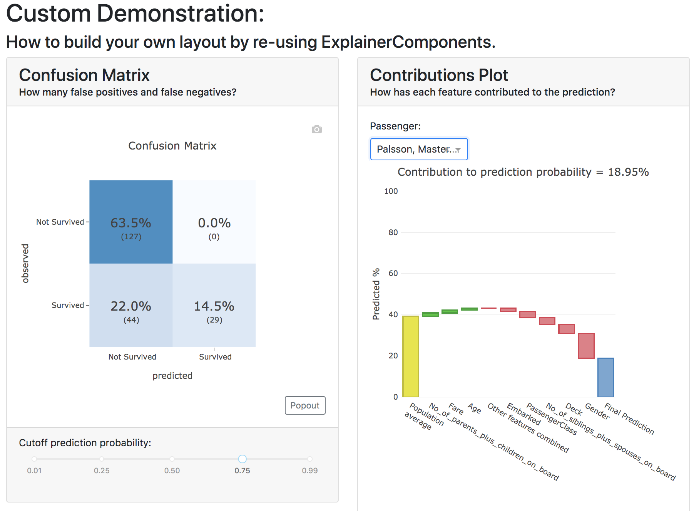

Building custom layout
**********************

You can build your own custom dashboard layout by re-using the modular  
:ref:`ExplainerComponents and connectors<ExplainerComponents>` without needing 
to know much about web development or even much about `plotly dash <https://dash.plotly.com/>`_, 
which is the underlying technology that ``explainerdashboard`` is built on.

You can get some inspiration from the `explainerdashboard composites <https://github.com/oegedijk/explainerdashboard/blob/master/explainerdashboard/dashboard_components/composites.py>`_
that build the layout of the default dashboard tabs. You can copy that code
move some of the components around and add some text to make it specific to 
your own project. 

Simple Example
==============

For example if you only wanted to build a custom dashboard that only contains 
a ``ConfusionMatrixComponent`` and a ``ShapContributionsGraphComponent``, 
but you want to hide a few toggles::

    from explainerdashboard.custom import *

    class CustomDashboard(ExplainerComponent):
        def __init__(self, explainer, name=None):
            super().__init__(explainer, title="Custom Dashboard")
            self.confusion = ConfusionMatrixComponent(explainer, name=self.name+"cm",
                                hide_selector=True, hide_percentage=True,
                                cutoff=0.75)
            self.contrib = ShapContributionsGraphComponent(explainer, name=self.name+"contrib",
                                hide_selector=True, hide_cats=True, 
                                hide_depth=True, hide_sort=True,
                                index='Rugg, Miss. Emily')
            
        def layout(self):
            return dbc.Container([
                dbc.Row([
                    dbc.Col([
                        html.H1("Custom Demonstration:"),
                        html.H3("How to build your own layout using ExplainerComponents.")
                    ])
                ]),
                dbc.Row([
                    dbc.Col([
                        self.confusion.layout(),
                    ]),
                    dbc.Col([
                        self.contrib.layout(),
                    ])
                ])
            ])

    db = ExplainerDashboard(explainer, CustomDashboard, hide_header=True)
    db.run()

So you need to 

1. Import ``ExplainerComponents`` with ``from explainerdashboard.custom import *``. (this also
   imports ``dash_html_components as html``, ``dash_core_components as dcc`` and
   ``dash_bootstrap_components as dbc`` for you.

2. Derive a child class from ``ExplainerComponent``. 

3. Include ``explainer, name=None`` in your ``__init__()``.

4. Call the init of the parent class with ``super().__init__(explainer, title)``. 

5. Instantiate the components that you wish to include as attributes in your ``__init__``: 
   ``self.confusion = ConfusionMatrixComponent(explainer)`` and 
   ``self.contrib = ShapContributionsGraphComponent(explainer)``

6. Pass a unique name to each subcomponent, using the name of your component, 
   e.g. ``name=self.name+"dep"``.

7. Define a ``layout()`` method that returns a custom layout.

8. Build your layout using ``html`` and bootstrap (``dbc``) elements and 
   include your components' layout in this overall layout with ``self.confusion.layout()``
   and ``self.contrib.layout()``.

9. Pass the class to an ``ExplainerDashboard`` and ``run()`` it. 

You can find the list of all ``ExplainerComponents`` in the :ref:`documentation<ExplainerComponents>`.

.. note::
    To save on boilerplate code, parameters in the ``__init__`` will automagically be 
    stored to attributes by ``super().__init__(explainer, title)``. So in the example 
    below you do not have to explicitly call ``self.a = a`` in the init::

        class CustomDashboard(ExplainerComponent):
            def __init__(self, explainer, name=None, a=1):
                super().__init__(explainer)

        custom = CustomDashboard(explainer)
        assert custom.a == 1

    This includes the naming of the component itself, by setting ``name=None``, 
    in the ``__init__``. ``ExplainerDashboard`` will then assign a unique 
    name of your component to make sure that component `id`'s will not clash,
    but will be consistent with multi worker or multi node deployments.

Including ExplainerComponents in regular ``dash`` app
=====================================================

An ``ExplainerComponent`` can easily be included in regular `dash <https://dash.plotly.com/>`_ code::

    import dash 

    custom = CustomDashboard(explainer)

    app = dash.Dash(__name__)
    app.title = "Dash demo"
    app.layout = html.Div([
        custom.layout()
        ])
    custom.register_callbacks(app)
    app.run_server()

Constructing the layout
=======================

You construct the layout using ``dash_bootstrap_components`` and
``dash_html_components``:

dash_bootstrap_components
-------------------------

Using the ``dash_bootstrap_components`` library it is very easy to construct
a modern looking responsive web interface with just a few lines of python code. 

The basis of any layout is that you divide your layout
into ``dbc.Rows`` and then divide each row into a number of ``dbc.Cols`` where the total 
column widths should add up to 12. (e.g. two columns of width 6 each)

Then ``dash_bootstrap_components`` offer a lot of other modern web design 
elements such as cards, modals, etc that you can find more information on in
their documentation: `https://dash-bootstrap-components.opensource.faculty.ai/ <https://dash-bootstrap-components.opensource.faculty.ai/>`_

dash_html_components
--------------------

If you know a little bit of html then using ``import dash_html_components as html`` you
can add further elements to your design. For example in order to insert a header
add ``html.H1("This is my header!")``, etc.

Elaborate Example
=================

CustomModelTab
--------------

A more elaborate example is below where we include three components: the 
precision graph, the shap summary and the shap dependence component, and
add explanatory text on either side of each component. The ``ShapSummaryDependenceConnector``
connects a ShapSummaryComponent and a ShapDependenceComponent so that when you 
select a feature in the summary, it automatically gets selected in the dependence 
plot. You can find other connectors such :ref:`IndexConnector<IndexConnector>`,
:ref:`PosLabelConnector<PosLabelConnector>`, :ref:`CutoffConnector<CutoffConnector>`
and :ref:`HighlightConnector<HighlightConnector>` in the :ref:`Connector documentation<Connectors>`::

    import dash_html_components as html
    import dash_bootstrap_components as dbc

    from explainerdashboard.custom import *
    from explainerdashboard import ExplainerDashboard

    class CustomModelTab(ExplainerComponent):
        def __init__(self, explainer, name=None):
            super().__init__(explainer, title="Titanic Explainer")
            self.precision = PrecisionComponent(explainer, name=self.name+"precision",
                                    hide_cutoff=True, hide_binsize=True, 
                                    hide_binmethod=True, hide_multiclass=True,
                                    hide_selector=True,
                                    cutoff=None)
            self.shap_summary = ShapSummaryComponent(explainer, name=self.name+"summary",
                                    hide_title=True, hide_selector=True,
                                    hide_depth=True, depth=8, 
                                    hide_cats=True, cats=True)
            self.shap_dependence = ShapDependenceComponent(explainer, name=self.name+"dep",
                                    hide_title=True, hide_selector=True,
                                    hide_cats=True, cats=True, 
                                    hide_index=True,
                                    col='Fare', color_col="PassengerClass")
            self.connector = ShapSummaryDependenceConnector(
                    self.shap_summary, self.shap_dependence)
            
        def layout(self):
            return dbc.Container([
                html.H1("Titanic Explainer"),
                dbc.Row([
                    dbc.Col([
                        html.H3("Model Performance"),
                        html.Div("As you can see on the right, the model performs quite well."),
                        html.Div("The higher the predicted probability of survival predicted by"
                                "the model on the basis of learning from examples in the training set"
                                ", the higher is the actual percentage for a person surviving in "
                                "the test set"),
                    ], width=4),
                    dbc.Col([
                        html.H3("Model Precision Plot"),
                        self.precision.layout()
                    ])
                ]),
                dbc.Row([
                    dbc.Col([
                        html.H3("Feature Importances Plot"),
                        self.shap_summary.layout()
                    ]),
                    dbc.Col([
                        html.H3("Feature importances"),
                        html.Div("On the left you can check out for yourself which parameters were the most important."),
                        html.Div(f"{self.explainer.columns_ranked_by_shap(cats=True)[0]} was the most important"
                                f", followed by {self.explainer.columns_ranked_by_shap(cats=True)[1]}"
                                f" and {self.explainer.columns_ranked_by_shap(cats=True)[2]}."),
                        html.Div("If you select 'detailed' you can see the impact of that variable on "
                                "each individual prediction. With 'aggregate' you see the average impact size "
                                "of that variable on the finale prediction."),
                        html.Div("With the detailed view you can clearly see that the the large impact from Sex "
                                "stems both from males having a much lower chance of survival and females a much "
                                "higher chance.")
                    ], width=4)
                ]),
                dbc.Row([
                    dbc.Col([
                        html.H3("Relations between features and model output"),
                        html.Div("In the plot to the right you can see that the higher the priace"
                                "of the Fare that people paid, the higher the chance of survival. "
                                "Probably the people with more expensive tickets were in higher up cabins, "
                                "and were more likely to make it to a lifeboat."),
                        html.Div("When you color the impacts by the PassengerClass, you can clearly see that "
                                "the more expensive tickets were mostly 1st class, and the cheaper tickets "
                                "mostly 3rd class."),
                        html.Div("On the right you can check out for yourself how different features impact "
                                "the model output."),
                    ], width=4),
                    dbc.Col([
                        html.H3("Feature impact plot"),
                        self.shap_dependence.layout()
                    ]),
                ])
            ])
    
    ExplainerDashboard(explainer, CustomModelTab, hide_header=True).run()

.. note::
    All subcomponents that are defined as attibutes in the ``__init__``, either
    explicitly or automagically through the ``super().__init__``, and 
    hence are added to ``self.__dict__`` also automatically get their callbacks 
    registered when you call ``.register_callbacks(app)`` on the parent component. 
    If you would like to exclude that (for example because the subcomponent has 
    already been initialized elsewhere and you just need to store the reference),
    then you can exclude it with ``exclude_callbacks(components)``::

        class CustomDashboard(ExplainerComponent):
            def __init__(self, explainer, name=None, feature_input_component):
                super().__init__(explainer)
                self.exclude_callbacks(self.feature_input_component)

CustomPredictionsTab
--------------------

We can also add another tab to investigate individual predictions, that 
includes an index selector, a SHAP contributions graph and a Random Forest
individual trees graph. The ``IndexConnector`` connects the index selected
in ``ClassifierRandomIndexComponent`` with the index dropdown in the 
contributions graph and trees components. We also pass a 
custom `dbc theme <https://dash-bootstrap-components.opensource.faculty.ai/docs/themes/>`_ 
called FLATLY as a custom css file::

    class CustomPredictionsTab(ExplainerComponent):
        def __init__(self, explainer, name=None):
            super().__init__(explainer, title="Predictions")
            
            self.index = ClassifierRandomIndexComponent(explainer, name=self.name+"index",
                                                        hide_title=True, hide_index=False, 
                                                        hide_slider=True, hide_labels=True, 
                                                        hide_pred_or_perc=True, 
                                                        hide_selector=True, hide_button=False)
            
            self.contributions = ShapContributionsGraphComponent(explainer, name=self.name+"contrib",
                                                                hide_title=True, hide_index=True, 
                                                                hide_depth=True, hide_sort=True, 
                                                                hide_orientation=True, hide_cats=True, 
                                                                hide_selector=True,  
                                                                sort='importance')
            
            self.trees = DecisionTreesComponent(explainer, name=self.name+"trees",
                                                hide_title=True, hide_index=True, 
                                                hide_highlight=True, hide_selector=True)

            self.connector = IndexConnector(self.index, [self.contributions, self.trees])
            
        def layout(self):
            return dbc.Container([
                dbc.Row([
                    dbc.Col([
                        html.H3("Enter name:"),
                        self.index.layout()
                    ])
                ]),
                dbc.Row([
                    dbc.Col([
                        html.H3("Contributions to prediction:"),
                        self.contributions.layout()
                    ]),

                ]),
                dbc.Row([

                    dbc.Col([
                        html.H3("Every tree in the Random Forest:"),
                        self.trees.layout()
                    ]),
                ])
            ])

    ExplainerDashboard(explainer, [CustomModelTab, CustomPredictionsTab], 
                   title='Titanic Explainer',
                   header_hide_selector=True, 
                   bootstrap=dbc.themes.FLATLY).run()

Below you can see the result. (also note how the component title shows up as
the tab title). This dashboard has also been deployed at 
`http://titanicexplainer.herokuapp.com/custom <http://titanicexplainer.herokuapp.com/custom>`_:

.. image:: screenshots/custom_dashboard.*

Comparing multiple models
=========================

You can also compare multiple models in the same dashboard, or inside the same
tab. In this case it is important to already instantiate the component/tab before
passing it on to the ``ExplainerDashboard``::

    from explainerdashboard import *
    from explainerdashboard.datasets import *
    from explainerdashboard.custom import *

    from sklearn.ensemble import RandomForestClassifier
    from xgboost import XGBClassifier

    X_train, y_train, X_test, y_test = titanic_survive()

    model1 = RandomForestClassifier(n_estimators=50, max_depth=4).fit(X_train, y_train)
    model2 = XGBClassifier(n_estimators=10, max_depth=5).fit(X_train, y_train)
    
    explainer1 = ClassifierExplainer(model1, X_test, y_test)
    explainer2 = ClassifierExplainer(model2, X_test, y_test)

    class ConfusionComparison(ExplainerComponent):
        def __init__(self, explainer1, explainer2):
            super().__init__(explainer1)
            self.confmat1 = ConfusionMatrixComponent(explainer1, cutoff=0.6,
                                hide_selector=True, hide_percentage=True)
            self.confmat2 = ConfusionMatrixComponent(explainer2, cutoff=0.6,
                                hide_selector=True, hide_percentage=True)
            
        def layout(self):
            return dbc.Container([
                dbc.Row([
                    dbc.Col([
                        self.confmat1.layout()   
                    ]),
                    dbc.Col([
                        self.confmat2.layout()   
                    ])
                ])
            ])
        
    tab = ConfusionComparison(explainer1, explainer2)

    ExplainerDashboard(explainer1, tab).run()
