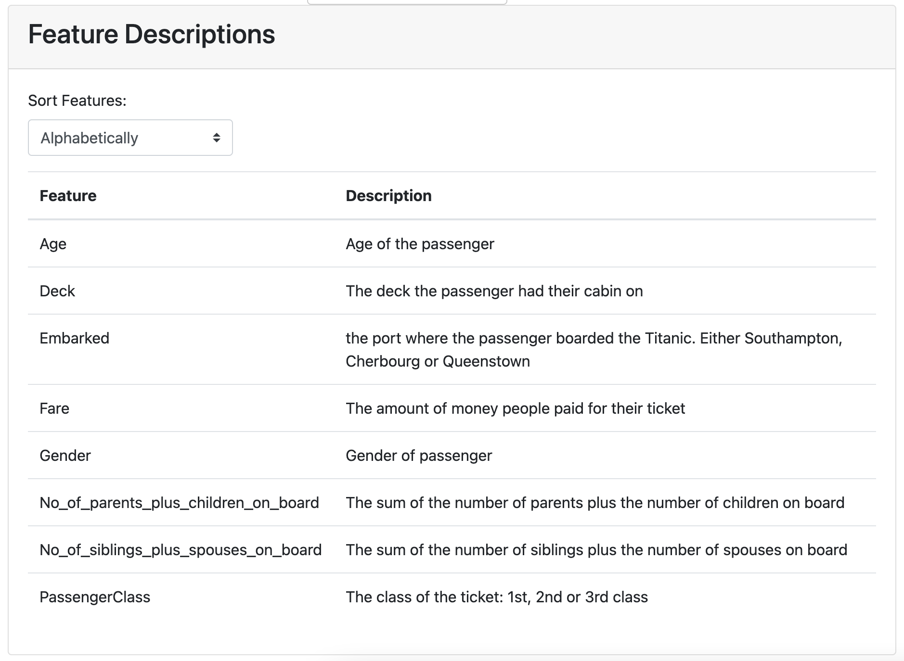

ExplainerComponents
*******************

The dashboard is constructed out of ``ExplainerComponents``: self-contained reusable
elements usually consisting of a plot or table and various dropdowns, sliders 
and toggles to manipulate that plot. Components can be connected with connectors,
so that when you select an index in one component that automatically updates the
index in another component for example.

When you run ``ExplainerDashboard`` you get the default dashboard with basically
every component listed below with every toggle and slider visible. 

The ``ExplainerComponents`` make it very easy to construct your own dashboard
with your own layout, with specific explanations for the workings and results
of your model. So you can select which components to use, where to put them
in the layout, which toggles and sliders to display, and what the initial values
for component should be. This way you can also control which interactive 
aspects your end users can and cannot control.  

You import the components with ``from explainerdashboard.custom import *``

A simple example, where you build a page with only a ``ShapDependenceComponent``,
but with no group cats or highlight toggle, and initial feature set to 'Fare'::

   from explainerdashboard.custom import *

   class CustomDashboard(ExplainerComponent):
      def __init__(self, explainer, title="Custom Dashboard", name="None"):
         super().__init__(explainer, title, name=name)
         self.shap_dependence = ShapDependenceComponent(explainer, name=self.name+"dep",
                            hide_title=True, hide_cats=True, hide_highlight=True,
                            cats=True, col='Fare')

      def layout(self):
         return html.Div([
            self.shap_dependence.layout()
        ])  
    
    ExplainerDashboard(explainer, CustomDashboard).run()

ExplainerComponent
==================

Each component subclasses ``ExplainerComponent`` which provides the basic
functionality of registering subcomponents, dependencies, registering callbacks 
of subcomponents, calculating dependencies, and providing a list of pos label 
selectors of all subcomponents.

ExplainerComponent
------------------

.. autoclass:: explainerdashboard.dashboard_methods.ExplainerComponent
   :members:

shap_components
===============

ShapSummaryComponent
--------------------

.. image:: screenshots/components/shap_summary.png

.. image:: screenshots/components/shap_summary_detailed.png

.. autoclass:: explainerdashboard.dashboard_components.shap_components.ShapSummaryComponent
   :members:

ShapDependenceComponent
-----------------------

.. image:: screenshots/components/shap_dependence.png

.. image:: screenshots/components/shap_dependence_cats.png

.. autoclass:: explainerdashboard.dashboard_components.shap_components.ShapDependenceComponent
   :members:

ShapSummaryDependenceConnector
------------------------------

.. autoclass:: explainerdashboard.dashboard_components.shap_components.ShapSummaryDependenceConnector
   :members:

InteractionSummaryComponent
---------------------------

.. image:: screenshots/components/interaction_summary.png

.. autoclass:: explainerdashboard.dashboard_components.shap_components.InteractionSummaryComponent
   :members:

InteractionDependenceComponent
------------------------------

.. image:: screenshots/components/shap_interaction.png

.. autoclass:: explainerdashboard.dashboard_components.shap_components.InteractionDependenceComponent
   :members:

InteractionSummaryDependenceConnector
-------------------------------------

.. autoclass:: explainerdashboard.dashboard_components.shap_components.InteractionSummaryDependenceConnector
   :members:

ShapContributionsTableComponent
-------------------------------

.. image:: screenshots/components/contribs_table.png

.. autoclass:: explainerdashboard.dashboard_components.shap_components.ShapContributionsTableComponent
   :members:

ShapContributionsGraphComponent
-------------------------------

.. image:: screenshots/components/contribs_graph.png

.. autoclass:: explainerdashboard.dashboard_components.shap_components.ShapContributionsGraphComponent
   :members:

overview_components
===================

PredictionSummaryComponent
--------------------------

.. image:: screenshots/components/pred_summary_clas.png

.. image:: screenshots/components/pred_summary_reg.png

.. autoclass:: explainerdashboard.dashboard_components.overview_components.PredictionSummaryComponent
   :members:

   
ImportancesComponent
--------------------

.. image:: screenshots/components/importances.png

.. autoclass:: explainerdashboard.dashboard_components.overview_components.ImportancesComponent
   :members:

FeatureDescriptionsComponent
--------------------

.. autoclass:: explainerdashboard.dashboard_components.overview_components.FeatureDescriptionsComponent
   :members:

PdpComponent
------------

.. image:: screenshots/components/pdp.png

.. autoclass:: explainerdashboard.dashboard_components.overview_components.PdpComponent
   :members:

FeatureInputComponent
---------------------

.. image:: screenshots/components/feature_input.png

Using the feature input component you can edit the features for a particular
observation in order to check what would be the change in prediction if you
change one or more features. 

You can connect the ``FeatureInputComponent`` to the 
``ShapContributionsGraphComponent`` and the ``PdpComponent`` using 
the``feature_input_component`` parameter::

   class WhatIfComposite(ExplainerComponent):
      def __init__(self, explainer, title="What if..."):
         super().__init__(explainer, title, name)

         self.input = FeatureInputComponent(explainer)
         self.contrib = ShapContributionsGraphComponent(explainer, feature_input_component=self.input)
         self.pdp = PdpComponent(explainer, feature_input_component=self.input)

.. autoclass:: explainerdashboard.dashboard_components.overview_components.FeatureInputComponent
   :members:

classifier_components
=====================

ClassifierRandomIndexComponent
------------------------------

.. image:: screenshots/components/classifier_index.png

.. autoclass:: explainerdashboard.dashboard_components.classifier_components.ClassifierRandomIndexComponent
   :members:

ClassifierPredictionSummaryComponent
------------------------------------

.. image:: screenshots/components/classifier_prediction.png

.. autoclass:: explainerdashboard.dashboard_components.classifier_components.ClassifierPredictionSummaryComponent
   :members:

ConfusionMatrixComponent
------------------------

.. image:: screenshots/components/confusion_matrix.png

.. autoclass:: explainerdashboard.dashboard_components.classifier_components.ConfusionMatrixComponent
   :members:

LiftCurveComponent
------------------

.. image:: screenshots/components/lift_curve.png

.. autoclass:: explainerdashboard.dashboard_components.classifier_components.LiftCurveComponent
   :members:

ClassificationComponent
-----------------------

.. image:: screenshots/components/classification.png

.. autoclass:: explainerdashboard.dashboard_components.classifier_components.ClassificationComponent
   :members:

RocAucComponent
---------------

.. image:: screenshots/components/roc_auc.png

.. autoclass:: explainerdashboard.dashboard_components.classifier_components.RocAucComponent
   :members:

PrAucComponent
--------------

.. image:: screenshots/components/pr_auc.png

.. autoclass:: explainerdashboard.dashboard_components.classifier_components.PrAucComponent
   :members:

PrecisionComponent
------------------

.. image:: screenshots/components/precision.png

.. autoclass:: explainerdashboard.dashboard_components.classifier_components.PrecisionComponent
   :members:

CumulativePrecisionComponent
----------------------------

.. image:: screenshots/components/cumulative_lift.png

.. autoclass:: explainerdashboard.dashboard_components.classifier_components.CumulativePrecisionComponent
   :members:

ClassifierModelSummaryComponent
-------------------------------

.. autoclass:: explainerdashboard.dashboard_components.classifier_components.ClassifierModelSummaryComponent
   :members:

regression_components
=====================

RegressionRandomIndexComponent
------------------------------

.. image:: screenshots/components/regression_index.png

.. autoclass:: explainerdashboard.dashboard_components.regression_components.RegressionRandomIndexComponent
   :members:

RegressionPredictionSummaryComponent
------------------------------------

.. image:: screenshots/components/regression_prediction.png

.. autoclass:: explainerdashboard.dashboard_components.regression_components.RegressionPredictionSummaryComponent
   :members:

PredictedVsActualComponent
--------------------------

.. image:: screenshots/components/pred_vs_actual.png

.. autoclass:: explainerdashboard.dashboard_components.regression_components.PredictedVsActualComponent
   :members:

ResidualsComponent
------------------

.. image:: screenshots/components/residuals.png

.. autoclass:: explainerdashboard.dashboard_components.regression_components.ResidualsComponent
   :members:

RegressionVsColComponent
------------------------

.. image:: screenshots/components/reg_vs_col.png

.. autoclass:: explainerdashboard.dashboard_components.regression_components.RegressionVsColComponent
   :members:

RegressionModelSummaryComponent
-------------------------------

.. autoclass:: explainerdashboard.dashboard_components.regression_components.RegressionModelSummaryComponent
   :members:

decisiontree_components
=======================

DecisionTreesComponent
----------------------

.. image:: screenshots/components/trees.png

.. image:: screenshots/components/xgb_trees.png

.. autoclass:: explainerdashboard.dashboard_components.decisiontree_components.DecisionTreesComponent
   :members:

DecisionPathTableComponent
--------------------------

.. image:: screenshots/components/tree_table.png

.. autoclass:: explainerdashboard.dashboard_components.decisiontree_components.DecisionPathTableComponent
   :members:

DecisionPathGraphComponent
--------------------------

.. image:: screenshots/components/tree_viz.png

.. autoclass:: explainerdashboard.dashboard_components.decisiontree_components.DecisionPathGraphComponent
   :members:

Connectors
==========

CutoffPercentileComponent
-------------------------

.. autoclass:: explainerdashboard.dashboard_components.connectors.CutoffPercentileComponent
   :members:

PosLabelSelector
----------------

.. image:: screenshots/components/poslabel_selector.png

.. autoclass:: explainerdashboard.dashboard_methods.PosLabelSelector
   :members:

PosLabelConnector
-----------------

.. autoclass:: explainerdashboard.dashboard_components.connectors.PosLabelConnector
   :members:

CutoffConnector
---------------

.. autoclass:: explainerdashboard.dashboard_components.connectors.CutoffConnector
   :members:

IndexConnector
--------------

.. autoclass:: explainerdashboard.dashboard_components.connectors.IndexConnector
   :members:

HighlightConnector
------------------

.. autoclass:: explainerdashboard.dashboard_components.connectors.HighlightConnector
   :members:

   
