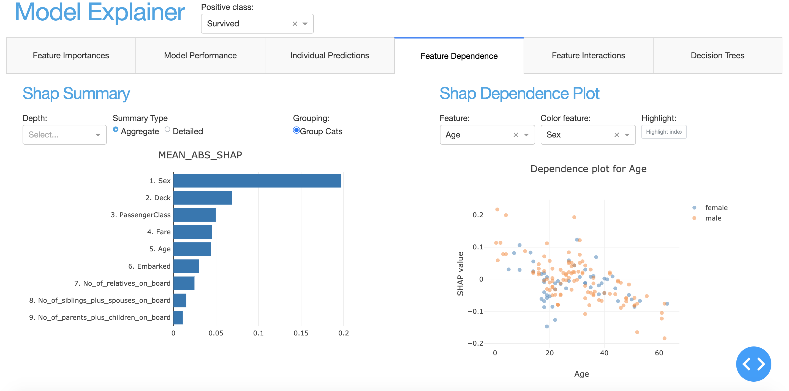
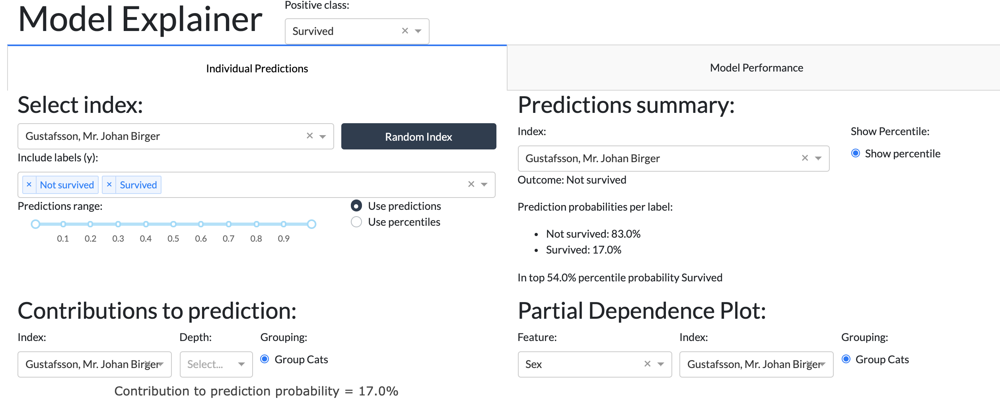

ExplainerDashboard
******************

Starting the default dashboard
------------------------------

In order to start an ``ExplainerDashboard`` you first need to contruct an ``Explainer`` instance.
On the basis of this explainer you can then quickly start an interactive dashboard. 

The ``ExplainerDashboard`` API is quite flexible. By default it tries to display
all the default tabs that are compatible with your ``model`` and ``model_output`` 
(i.e. interactions and decision_trees might be excluded)::

   explainer = ClassifierExplainer(model, X_test, y_test)
   ExplainerDashboard(explainer).run()

Switching off tabs with booleans
--------------------------------

If you'd like a little bit more control over which tabs are displayed, you can 
switch off individual tabs with their respective booleans 
(they all default to True)::

   ExplainerDashboard(explainer, 
      importances=True,
      model_summary=False,
      contributions=True,
      shap_dependence=True,
      shap_interaction=False
      decision_trees=True
   ).run()

Warning: the interactions tab can take quite some time to compute, 
so you may want to switch it off if you're not particularly 
interested in interaction effects between features.

Starting a single tab dashboard
-------------------------------

If you pass a single ExplainerComponent class or instance or string identifier,
ExplainerDashboard will display that component as a standalone page. 
The following three lines will all have the effect of launching an ImportancesTab 
as a single page::

   from explainerdashboard.dashboard_tabs import *

   ExplainerDashboard(explainer, ImportancesTab).run()

   imp_tab = ImportancesTab(explainer)
   ExplainerDashboard(explainer, imp_tab).run()

   ExplainerDashboard(explainer, "importances").run()

You can also pass any custom class instance as long as it has at least a ``.layout()`` method.
If the custom class does not have a ``title`` or ``name`` property, these will
be assigned. If the custom class has a ``.register_callbacks(self, app)`` method,
then this will be called. An example of an extremely minimalist dashboard that only displays 
the feature names of the model::

   import dash_html_components as html 

   class FeatureListTab:
      def __init__(self, explainer):
         self.explainer  = explainer
         self.title = "Feature List"
         self.name = "feature_list"

      def layout(self):
         return html.Div(f"Feature names: {self.explainer.columns}")

      def register_callbacks(self, app):
         pass

   features = FeatureListTab(explainer)
   ExplainerDashboard(explainer, features).run()

However it would be easy to turn this custom ``FeatureListTab`` into a proper
``ExplainerComponent``::

   class FeatureListTab(ExplainerComponent):
      def __init__(self, explainer, title="Feature List", header_mode="none", name=None):
         super().__init__(explainer, title, header_mode, name)

      def _layout(self):
         return html.Div(f"Feature names: {self.explainer.columns}")

   ExplainerDashboard(explainer, FeatureListTab).run()

Starting a multitab dashboard
-----------------------------

Besided using the booleans as described above, you can also pass a list of 
``ExplainerComponents`` to construct multiple tabs. These can be a mix of 
the different types discussed above. E.g.::

   ExplainerDashboard(explainer, [ImportancesTab, imp_tab, "importances", features]).run()

This would start a dashboard with three importances tabs, plus our custom 
feature list tab. 

Using Dash or JupyterDash
-------------------------

You can start the dashboard with the standard ``dash.Dash()`` or with the 
new notebook friendly ``jupyter_dash`` library. The latter will allow you
to keep working interactively in your notebook while the dashboard is running.

The default dash server is started with ``mode='dash'``. There are three different 
options for ``jupyter_dash`` ``mode='inline'`` for running the dashboard in an 
output cell in your notebook, ``mode='jupyterlab'`` for runnning the dashboard in 
jupyterlab pane, or ``mode='external'`` which runs the dashboard in a seperate tab::

   ExplainerDashboard(explainer, mode='dash').run() # default
   ExplainerDashboard(explainer, mode='inline').run(port=8051)
   ExplainerDashboard(explainer, mode='jupyterlab').run(8052)
   ExplainerDashboard(explainer, mode='external').run()

The parameters ``width`` and ``height`` determine the size of the output area in pixels.
(default to ``1000x800``). You can kill a JupyterDash based dashboard with
``ExplainerDashboard().terminate(port)``.

.. image:: inline_example.png

Adding a theme
--------------

``explainerdashboard`` comes with a default blue css theme, but you can override 
it with the ``external_stylesheets`` parameter. Additional info on styling bootstrap
layout can be found at:  https://dash-bootstrap-components.opensource.faculty.ai/docs/themes/

You can add a theme by putting it in an ``/assets/`` subfolder, or by linking to it directly.
`dash_bootstrap_components` offer a convenient way of inserting these::

   import dash_bootstrap_components as dbc
   ExplainerDashboard(explainer, ["contributions", "model_summary"], 
                   external_stylesheets=[dbc.themes.FLATLY], 
                   mode='external').run()

Example of a nice flat black and white theme called "FLATLY":

The full list of available themes can be found on the 
`dbc documentation page. <https://dash-bootstrap-components.opensource.faculty.ai/docs/themes/>`_ 

Hiding title and label selector
-------------------------------

For multiclass classification models it is convenient to be able to set the
positive class for the entire dashboard with the dropdown in the header.
However if you wish to this dropdown selector you can simply pass ``header_hide_selector=True``.

In order to also hide the title itself pass ``header_hide_title=True``.

Choosing a port
---------------

By default ``dash`` apps run on port 8050, however you can choose any other port
in the run method::

   ExplainerDashboard(explainer).run(port=8051)

Or even shorter::

   ExplainerDashboard(explainer).run(8051)

Exposing the flask server
-------------------------

When running a dashboard in production you probably want to run it with some 
heavier web server like ``gunicorn``. For this you need to expose the flask 
server. This can be found in ``self.app.server``, or with the ``flask_server()`` method.

If you define your dashboard in dashboard.py then you can expose your dashboard
server like this::

   db = ExplainerDashboard(explainer)
   server = db.flask_server()
   # equivalently: server = db.app.server

You then start the dashboard on the commandline with::

   gunicorn dashboard:server

ExplainerDashboard documentation
--------------------------------

.. autoclass:: explainerdashboard.dashboards.ExplainerDashboard
   :members: run, terminate, flask_server
   :member-order: bysource

