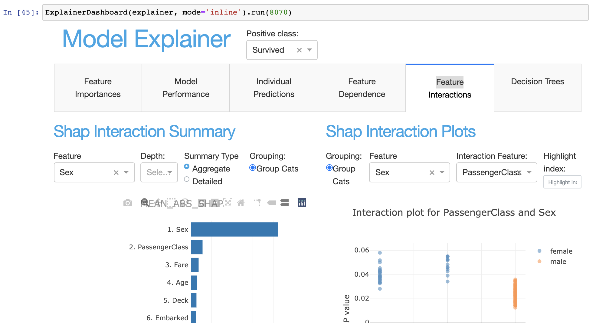

ExplainerDashboard
******************

Starting the default dashboard
------------------------------

In order to start an ``ExplainerDashboard`` you first need to contruct an ``Explainer`` instance.
On the basis of this explainer you can then quickly start an interactive dashboard. 

The ``ExplainerDashboard`` API is quite flexible. By default it tries to display
all the default tabs that are compatible with your ``model`` and ``model_output`` 
(i.e. interactions and decision_trees might be excluded)::

   from explainerdashboard import ClassifierExplainer, ExplainerDashboard

   explainer = ClassifierExplainer(model, X_test, y_test)
   ExplainerDashboard(explainer).run()

.. image:: screenshots/screenshot.png

Simplified single page dashboard
--------------------------------

For a simplified single page dashboard, use::

   ExplainerDashboard(explainer, simple=True).run()

.. raw:: html

   

   
screenshot

.. image:: screenshots/simple_classifier_dashboard.png

.. raw:: html

   

   

Switching off tabs with booleans
--------------------------------

If you'd like a little bit more control over which tabs are displayed, you can 
switch off individual tabs with their respective booleans 
(they all default to True)::

   ExplainerDashboard(explainer, 
      importances=True,
      model_summary=False,
      contributions=True,
      whatif=True,
      shap_dependence=True,
      shap_interaction=False
      decision_trees=True
   ).run()

.. note:: 
   The interactions tab can take quite some time to compute, 
   so you would usually switch it off if you're not particularly 
   interested in interaction effects between features.

Starting a single tab dashboard
-------------------------------

If you pass a single ExplainerComponent class or instance or string identifier,
ExplainerDashboard will display that component as a standalone page. 
The following three lines will all have the effect of launching an ImportancesTab 
as a single page::

   from explainerdashboard.custom import ImportancesComposite

   ExplainerDashboard(explainer, ImportancesComposite).run()

   imp_tab = ImportancesTab(explainer)
   ExplainerDashboard(explainer, imp_tab).run()

   ExplainerDashboard(explainer, "importances").run()

Starting a multitab dashboard
-----------------------------

Besided the single page dashboard above you can also pass a list of 
``ExplainerComponents`` to construct multiple tabs. These can be a mix of 
the different types discussed above. E.g.::

   ExplainerDashboard(explainer, [ImportancesCompoiste, imp_tab, "importances"]).run()

This would start a dashboard with three importances tabs.
(not sure why you would do that, but hopefully you get the point :)

The tabs can be imported from ``explainerdashboard.custom``, they include
``ImportancesComposite``, ``ModelSummaryComposite``, ``IndividualPredictionsComposite``, 
``WhatIfComposite``, ``ShapDependenceComposite``, ``ShapInteractionsComposite`` 
and ``DecisionTreesComposite``.

You can also build your own custom tabs, see the :ref:`Custom Dashboards<Custom Dashboards>` section.

Using explainerdashboard inside Jupyter notebook or google colab
----------------------------------------------------------------

You can start the dashboard with the standard ``dash.Dash()`` server or with the 
new notebook friendly ``JupyterDash`` server. The latter will allow you
to keep working interactively in your notebook while the dashboard is running.
Also, this allows you to run an explainerdashboard from within Google Colab!

The default dash server is started with ``mode='dash'``. (except in Google
Colab, where the default is ``mode='external'``) There are three notebook compatible 
options: ``mode='inline'`` for running the dashboard in an 
output cell in your notebook, ``mode='jupyterlab'`` for runnning the dashboard in 
jupyterlab pane, or ``mode='external'`` which runs the dashboard in a seperate tab::

   ExplainerDashboard(explainer).run() # default is either 'dash' or 'external' in colab
   ExplainerDashboard(explainer, mode='dash').run() 
   ExplainerDashboard(explainer, mode='inline').run(port=8051)
   ExplainerDashboard(explainer, mode='jupyterlab').run(8052)
   ExplainerDashboard(explainer, mode='external').run()

The parameters ``width`` and ``height`` determine the size of the output area in pixels.
(default to ``1000x800``). You can kill a JupyterDash based dashboard with the 
``classmethod`` ``.terminate(port)``::

   ExplainerDashboard().terminate(8050)

Adding a theme
--------------

``explainerdashboard`` comes with the default bootstrap theme, but you can override 
it with the ``bootstrap`` parameter. Additional info on styling bootstrap
layout can be found at:  https://dash-bootstrap-components.opensource.faculty.ai/docs/themes/

You can add a theme passing a url of the ``.css`` stylesheet. ``dash_bootstrap_components`` provide
a convenient ``themes`` module with urls to the most popular themes, e.g.::

   from dash_bootstrap_components.themes import FLATLY 

   ExplainerDashboard(explainer, ["contributions", "model_summary"], 
                   bootstrap=FLATLY, mode='external').run()

Example of a nice flat black and white theme called "FLATLY":

.. image:: screenshots/flatlytheme.png

The full list of available themes can be found on the 
`dbc documentation page. <https://dash-bootstrap-components.opensource.faculty.ai/docs/themes/>`_ 

Hiding title and label selector
-------------------------------

For multiclass classification models it is convenient to be able to set the
positive class for the entire dashboard with the dropdown in the header.
However if you wish to this dropdown selector you can simply pass ``header_hide_selector=True``.

In order to hide the title itself pass ``header_hide_title=True``. Or to hide 
the entire header pass ``hide_header=True``. 

Choosing a port
---------------

By default ``dash`` apps run on port 8050, however you can choose any other port
in the run method::

   ExplainerDashboard(explainer).run(port=8051)

Or even shorter::

   ExplainerDashboard(explainer).run(8051)

Exposing the flask server
-------------------------

When running a dashboard in production you probably want to run it with some 
heavier web server like ``gunicorn`` or ``waitress``. For this you need to expose the flask 
server. This can be found in ``self.app.server``, or with the ``flask_server()`` method.

If you define your dashboard in dashboard.py then you can expose your dashboard
server like this::

   db = ExplainerDashboard(explainer)
   server = db.flask_server()
   # equivalently: server = db.app.server

You then start the dashboard on the commandline with::

   gunicorn dashboard:server

Or if you are on windows::

   waitress-serve dashboard:server

See the deployment section for more info on using explainerdashboard in production.

ExplainerDashboard documentation
--------------------------------

.. autoclass:: explainerdashboard.dashboards.ExplainerDashboard
   :members: run, terminate, flask_server
   :member-order: bysource

