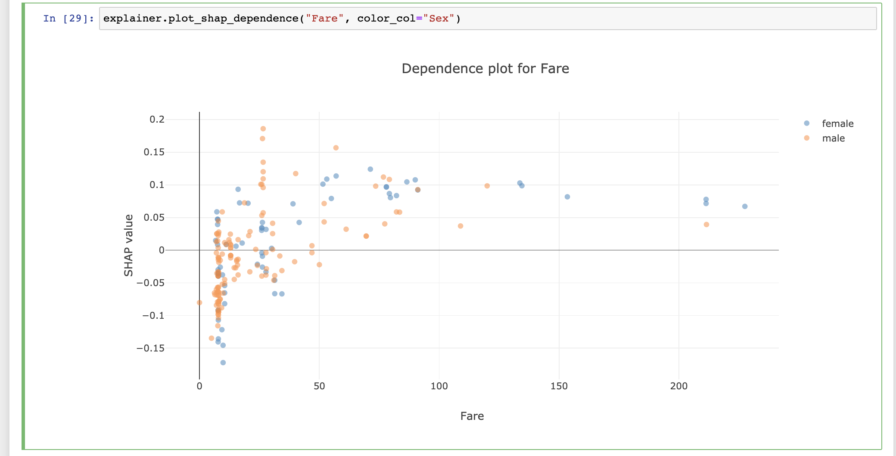

Explainers
**********

Simple example
==============

In order to start an ``ExplainerDashboard`` you first need to construct an 
``Explainer`` instance. They come in four flavours and at its most basic they 
only need a model, and a test set X and y::

    explainer = ClassifierExplainer(model, X_test, y_test)
    explainer = RegressionExplainer(model, X_test, y_test)
    explainer = RandomForestClassifierExplainer(model, X_test, y_test)
    explainer = RandomForestRegressionExplainer(model, X_test, y_test)

This is enough to launch an ExplainerDashboard::

    ExplainerDashboard(explainer).run()

.. image:: screenshot.png

Or you can use it interactively in a notebook to inspect your model::

    explainer.plot_confusion_matrix()
    explainer.plot_shap_contributions(index=0)
    explainer.plot_shap_dependence("Fare", color_col="Sex")

For the full lists of plots available see :ref:`Plots<Plots>`.

Explainer Parameters
====================

There are a number of optional parameters that can either make sure that
SHAP values get calculated in the appropriate way, or that make the explainer 
give a bit nicer and more convenient output::

    ClassifierExplainer(model, X_test, y_test, 
            shap='linear', X_background=X_train, model_output='logodds',
            cats=['Sex', 'Deck', 'Embarked'], # makes it easy to group onehotencoded vars
            idxs=test_names, #names of passengers # index by name
            descriptions=feature_descriptions, # show feature descriptions in plots
            labels=['Not survived', 'Survived'])

cats
----

If you have onehot-encoded your categorical variables, they will show up as a 
lot of independent features. This clutters your feature space, and often makes 
it hard to interpret the effect of the underlying categorical feature. 

However as long as you encoded the onehot categories with ``FeatureName_Category``,
then ``explainerdashboard`` can group these categories together again in 
the various plots and tables. For this you can pass a list of onehotencoded 
categorical features to the parameter ``cats``.
For the titanic example this would be:
    - ``Sex``: ``Sex_female``, ``Sex_male``
    - ``Deck``: ``Deck_A``, ``Deck_B``, etc
    - ``Embarked``: ``Embarked_Southampton``, ``Embarked_Cherbourg``, etc

So you would pass ``cats=['Sex', 'Deck', 'Embarked']``.

idxs
----

You may have specific identifiers (names, customer id's, etc) for each row in your dataset.
If you pass these the the Explainer object, you can index using both the 
numerical index, e.g. ``explainer.contrib_df(0)`` for the first row, or using the 
identifier, e.g. ``explainer.contrib_df("Braund, Mr. Owen Harris")``.

The proper name or id will be use used in all ``ExplainerComponents`` that
allow index selection.

descriptions
------------

``descriptions`` can be passed as a dictionary of descriptions for each variable.
In order to be explanatory, you often have to explain the meaning of the features 
themselves (especially if the naming is not obvious).
Passing the dict along to descriptions will show hover-over tooltips for the 
various variables in the dashboard.

labels
------
labels: The outcome variables for a classification problem are assumed to 
be encoded 0, 1 (, 2, 3, ...) This is not very human readable, so you can pass a 
list of human readable labels such as ``labels=['Not survived', 'Survived']``.

units
-----

For regression models the units of the y variable. E.g. if the model is predicting
house prices in dollar you can set ``units='$'``.

X_background
------------

Some models like LogisticRegression (as well as certain gradienst boosting 
algorithms in probability space) need a background dataset to calculate shap values. 
These can be passed as X_background. If you don't pass an X_background, Explainer 
uses X instead but gives off a warning.

model_output
------------

By default ``model_output`` for classifier is set to ``"probability"``, as this 
is more intuitively explainable to non data scientist stakeholders.
However for certain models (e.g. ``XGBClassifier``, ``LGBMCLassifier``, ``CatBoostClassifier``), 
need a background dataset X_background to calculate shap values in probability 
space, and are not able to calculate shap interaction values.
Therefore you can also pass model_output='logodds', in which case shap values 
get calculated and displayed in the dashboard as logodds.

shap
----

By default ``shap='guess'``, which means that the Explainer will try to guess 
based on the model what kind of shap explainer it needs: e.g. 
``shap.TreeExplainer(...)``, ``shap.LinearExplainer(...)``, etc.

In case the guess fails or you'd like to override it, you can set it manually:
e.g. ``shap='tree'``, ``shap='linear'``, ``shap='kernel'``, ``shap='deep'``, etc.

model_output, X_background example
----------------------------------

Putting it all together::

    from sklearn.linear_model import LogisticRegression

    model = LogisticRegression()
    model.fit(X_train, y_train)

    explainer = ClassifierExplainer(model, X_test, y_test, 
                                        shap='linear', 
                                        X_background=X_train, 
                                        model_output='logodds')
    ExplainerDashboard(explainer).run()

permutation_cv
--------------

Normally permuation importances get calculated over a single fold (assuming the
data is the test set). However if you pass the training set the the explainer,
you may wish to cross-validate calculate the permutation importances. In that
case pass the number of folds to ``permutation_cv``.

na_fill
-------

If you fill missing values with some extreme value such as ``-999``, these can
mess with the horizontal axis of your plots. In order to filter these out,
your need to tell the expaliner what the extreme value is that you used to fill.
Defaults to ``-999``.

Plots
=====

Shared Plots
------------

The abstract base class ``BaseExplainer`` defines most of the functionality 
such as feature importances (both SHAP and permutation based), SHAP values, SHAP interaction values
partial dependences, individual contributions, etc. Along with a number of convenient
plotting methods. In practice you will use ``ClassifierExplainer`` 
or ``RegressionExplainer``, however they both inherit all of these basic methods.

The BaseExplainer already provides a number of convenient plotting methods::

    plot_importances(kind='shap', topx=None, cats=False, round=3, pos_label=None)
    plot_shap_contributions(index, cats=True, topx=None, cutoff=None, round=2, pos_label=None)
    plot_shap_summary(topx=None, cats=False, pos_label=None)
    plot_shap_interaction_summary(col, topx=None, cats=False, pos_label=None)
    plot_shap_dependence(col, color_col=None, highlight_idx=None,pos_label=None)
    plot_shap_interaction(col, interact_col, highlight_idx=None, pos_label=None)
    plot_pdp(col, index=None, drop_na=True, sample=100, num_grid_lines=100, num_grid_points=10, pos_label=None)

example code::

    explainer = ClassifierExplainer(model, X, y, cats=['Sex', 'Deck', 'Embarked']) 
    explainer.plot_importances(cats=True)
    explainer.plot_shap_contributions(index=0, topx=5)
    explainer.plot_shap_dependence("Fare")
    explainer.plot_shap_interaction("Fare", "PassengerClass")
    explainer.plot_pdp("Sex", index=0)

Classifier Plots
----------------

``ClassifierExplainer`` defines a number of additional plotting methods::

    plot_precision(bin_size=None, quantiles=None, cutoff=None, multiclass=False, pos_label=None)
    plot_cumulative_precision(pos_label=None)
    plot_classification(cutoff=0.5, percentage=True, pos_label=None)
    plot_confusion_matrix(cutoff=0.5, normalized=False, binary=False, pos_label=None)
    plot_lift_curve(cutoff=None, percentage=False, round=2, pos_label=None)
    plot_roc_auc(cutoff=0.5, pos_label=None)
    plot_pr_auc(cutoff=0.5, pos_label=None)

example code::

    explainer = ClassifierExplainer(model, X, y, labels=['Not Survived', 'Survived'])
    explainer.plot_confusion_matrix(cutoff=0.6)
    explainer.plot_precision(quantiles=10, cutoff=0.6, multiclass=True)
    explainer.plot_lift_curve(percentage=True)
    explainer.plot_roc_auc(cutoff=0.7)
    explainer.plot_pr_auc(cutoff=0.3)

More examples in the `notebook on the github repo. <https://github.com/oegedijk/explainerdashboard/blob/master/explainer_examples.ipynb>`_

RandomForest Plots
------------------

There is an additional mixin class specifically for ``sklearn`` ``RandomForests``
that defines additional methods and plots to investigate and visualize 
individual decision trees within the random forest. ``RandomForestExplainer``
uses the ``dtreeviz`` library to visualize individual decision trees.

You can get a pd.DataFrame summary of the path that a specific index row took 
through a specific decision tree.
You can also plot the individual predictions of each individual tree for 
specific row in your data indentified by ``index``::

    explainer.decisiontree_df(tree_idx, index)
    explainer.decisiontree_df_summary(tree_idx, index)
    explainer.plot_trees(index)

And for dtreeviz visualization of individual decision trees (svg format)::

    explainer.decision_path(tree_idx, index)
    explainer.decision_path_file(tree_idx, index)
    explainer.decision_path_encoded(tree_idx, index)

This also works with classifiers and regression models::

    explainer = RandomForestClassifierExplainer(model, X, y)
    explainer = RandomForestRegressionExplainer(model, X, y)

BaseExplainer
=============

.. autoclass:: explainerdashboard.explainers.BaseExplainer
   :members: mean_abs_shap_df, permutation_importances_df, importances_df, contrib_df, to_sql,
            plot_importances, plot_shap_contributions, plot_shap_summary, 
            plot_shap_interaction_summary, plot_shap_dependence, plot_shap_interaction, plot_pdp
   :member-order: bysource

ClassifierExplainer
===================

For classification models where we try to predict the probability of each class
we have a derived class called ClassifierExplainer.

You can pass an additional parameter to ``__init__()`` with a list of label names. For
multilabel classifier you can set the positive class with e.g. ``explainer.pos_label=1``.
This will make sure that for example ``explainer.pred_probas`` will return the probability
of that label.You an also pass a string label if you passed ``labels`` to the constructor.

More examples in the `notebook on the github repo. <https://github.com/oegedijk/explainerdashboard/blob/master/explainer_examples.ipynb>`_

.. autoclass:: explainerdashboard.explainers.ClassifierExplainer
   :members: random_index, precision_df, 
        plot_precision, plot_cumulative_precision, plot_classification, 
        plot_lift_curve, plot_confusion_matrix, plot_roc_auc, plot_pr_auc
   :member-order: bysource

RegressionExplainer
===================

For regression models where we try to predict a certain quantity.

You can pass an additional parameter to ``__init__()`` with the units of the predicted quantity.

More examples in the `notebook on the github repo. <https://github.com/oegedijk/explainerdashboard/blob/master/explainer_examples.ipynb>`_

.. autoclass:: explainerdashboard.explainers.RegressionExplainer
   :members: random_index, residuals, metrics, prediction_result_markdown,
            plot_predicted_vs_actual, plot_residuals,  plot_residuals_vs_feature
   :member-order: bysource

RandomForestExplainer
=====================

.. autoclass:: explainerdashboard.explainers.RandomForestExplainer
   :members: decisiontree_df, decisiontree_df_summary, plot_trees, decision_path
   :member-order: bysource
   :exclude-members: 

RandomForestClassifierExplainer
-------------------------------

.. autoclass:: explainerdashboard.explainers.RandomForestClassifierExplainer
   :member-order: bysource
   :exclude-members: __init__

RandomForestRegressionExplainer
-------------------------------

.. autoclass:: explainerdashboard.explainers.RandomForestRegressionExplainer
   :member-order: bysource
   :exclude-members: __init__

