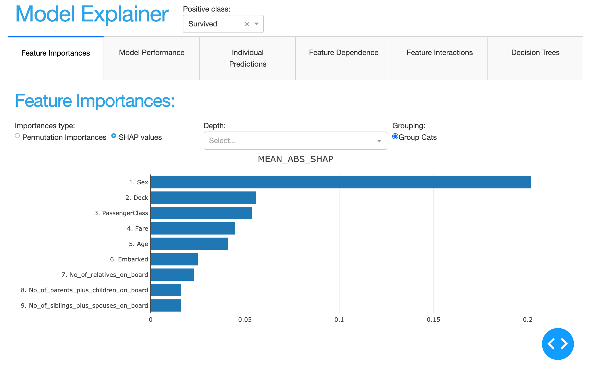
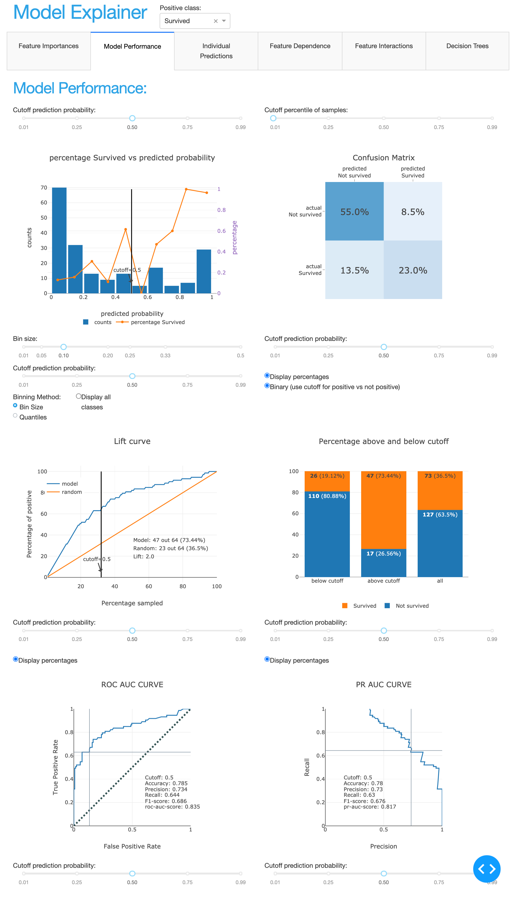
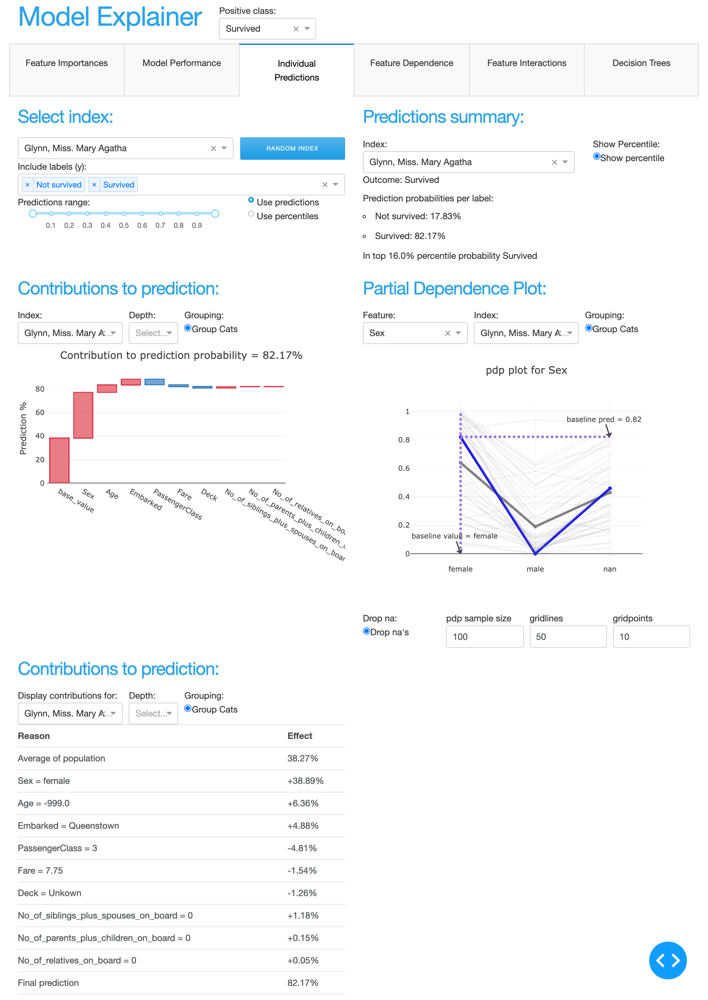
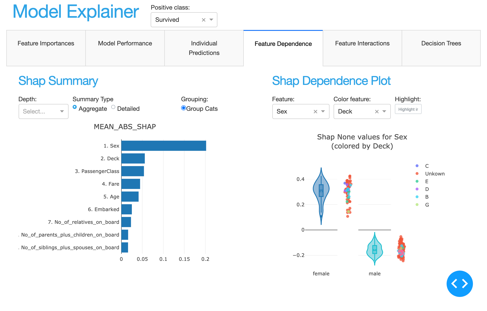
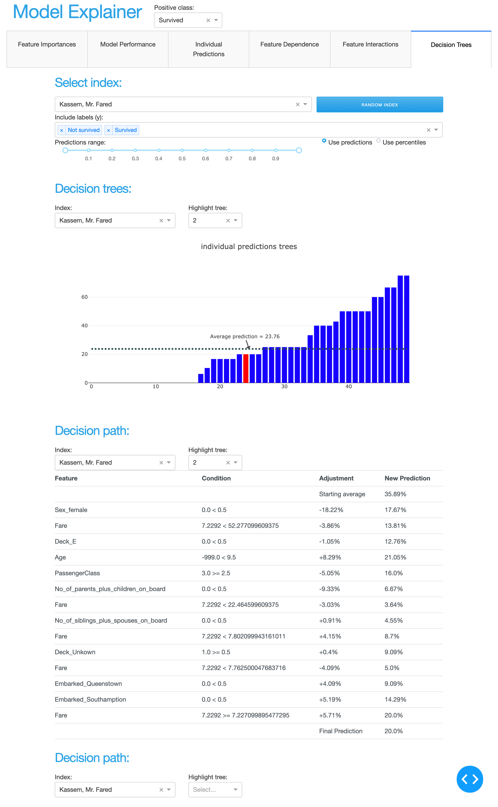

ExplainerTabs
*************

There are seven tabs that make up the default``ExplainerDashboard``::

   from explainerdashboard.dashboard_tabs import (ImportancesTab,
                                                   ModelSummaryTab,
                                                   ContributionsTab,
                                                   WhatIfTab,
                                                   ShapDependenceTab,
                                                   ShapInteractionsTab,
                                                   DecisionTreesTab)

Importances Tab
===============

Model Performance Tab
=====================

Individual Prediction Tab
=========================

What if... Tab
==============

.. image:: tab_whatif.png

Feature Dependence Tab
======================

Feature Interactions Tab
========================

.. image:: tab_interactions.png

Decisiontrees Tab
=================

ExplainerTabsLayout
===================

.. autoclass:: explainerdashboard.dashboards.ExplainerTabsLayout
   :members:

ExplainerPageLayout
===================

.. autoclass:: explainerdashboard.dashboards.ExplainerPageLayout
   :members:

ExplainerComposites
===================

Using the ExplainerComponent primitives and connectors it becomes easy to glue
together different components into a layout. A number of standard combinations of 
components have been defined as Composites. These then serve as the backbone 
for the various ExplainerTabs.

.. automodule:: explainerdashboard.dashboard_components.composites
   :members:

ExplainerTabs docs
==================

These are the standard tabs that you see when you build an ``ExplainerDashboard``.

Now they are mostly just a wrapper for the equivalent ExplainerComposites, but
kept around for naming clarity and backward compatibility.

.. automodule:: explainerdashboard.dashboard_tabs
   :members:

