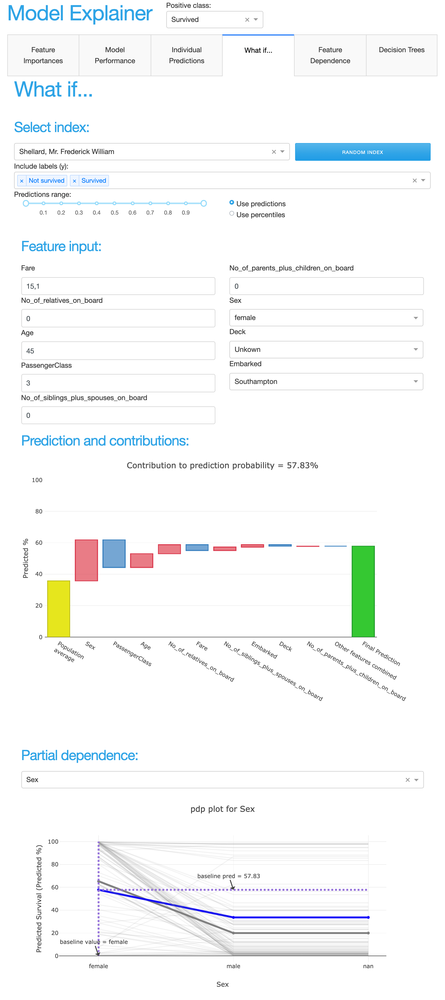
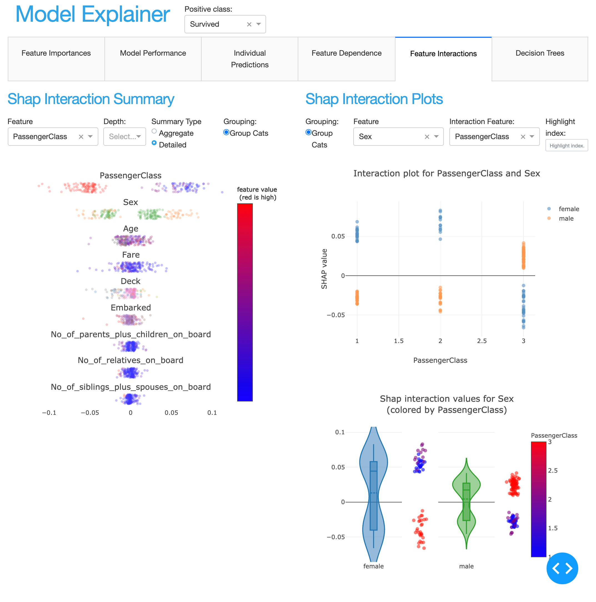
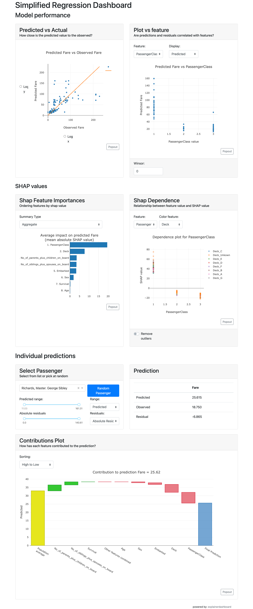

ExplainerTabs
*************

There are seven tabs that make up the default``ExplainerDashboard``::

   from explainerdashboard.custom import (ImportancesComposite,
                                          ModelSummaryComposite,
                                          IndividualPredictionsComposite,
                                          WhatIfComposite,
                                          ShapDependenceComposite,
                                          ShapInteractionsComposite,
                                          DecisionTreesComposite)

The definitions can be found `in the github repo <DecisionTreesComposite>`_ 
and can serve as a nice starting point for designing your own custom tabs. 

ImportancesComposite
====================

.. image:: screenshots/tab_importances.png

.. autoclass:: explainerdashboard.dashboard_components.composites.ImportancesComposite
   :members:

ClassifierModelStatsComposite
=============================

.. image:: screenshots/tab_model_performance.png

.. autoclass:: explainerdashboard.dashboard_components.composites.ClassifierModelStatsComposite
   :members:

RegressionModelStatsComposite
=============================

.. autoclass:: explainerdashboard.dashboard_components.composites.RegressionModelStatsComposite
   :members:

IndividualPredictionsComposite
==============================

.. image:: screenshots/tab_individual_predictions.png

.. autoclass:: explainerdashboard.dashboard_components.composites.IndividualPredictionsComposite
   :members:

WhatIfComposite
===============

.. autoclass:: explainerdashboard.dashboard_components.composites.WhatIfComposite
   :members:

ShapDependenceComposite
=======================

.. image:: screenshots/tab_feature_dependence.png

.. autoclass:: explainerdashboard.dashboard_components.composites.ShapDependenceComposite
   :members:

ShapInteractionsComposite
=========================

.. autoclass:: explainerdashboard.dashboard_components.composites.ShapInteractionsComposite
   :members:

DecisionTreesComposite
======================

.. image:: screenshots/tab_decision_trees.png

.. autoclass:: explainerdashboard.dashboard_components.composites.DecisionTreesComposite
   :members:

SimplifiedClassifierComposite
=============================

.. raw:: html

   

   
screenshot

.. image:: screenshots/simple_classifier_dashboard.png

.. raw:: html

   

   

You can also load this composite with::

   explainer = ClassifierExplainer(model, X, y)
   ExplainerDashboard(explainer, simple=True)

.. autoclass:: explainerdashboard.dashboard_components.composites.SimplifiedClassifierComposite
   :members:

SimplifiedRegressionComposite
=============================

.. raw:: html

   

   
screenshot

.. raw:: html

   

   

You can also load this composite with::

   explainer = RegressionExplainer(model, X, y)
   ExplainerDashboard(explainer, simple=True)

.. autoclass:: explainerdashboard.dashboard_components.composites.SimplifiedRegressionComposite
   :members:

ExplainerTabsLayout
===================

.. autoclass:: explainerdashboard.dashboards.ExplainerTabsLayout
   :members:

ExplainerPageLayout
===================

.. autoclass:: explainerdashboard.dashboards.ExplainerPageLayout
   :members:

